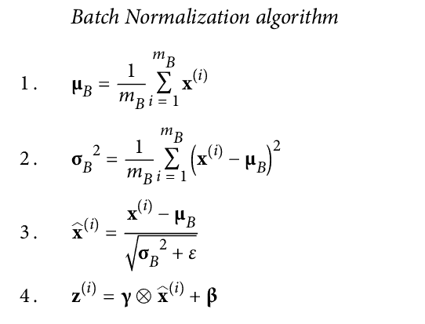
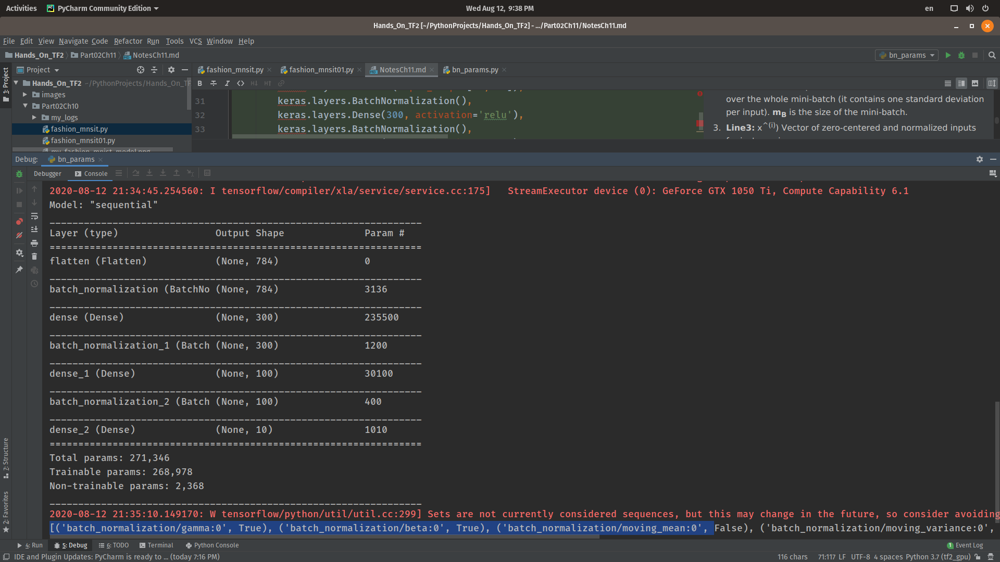
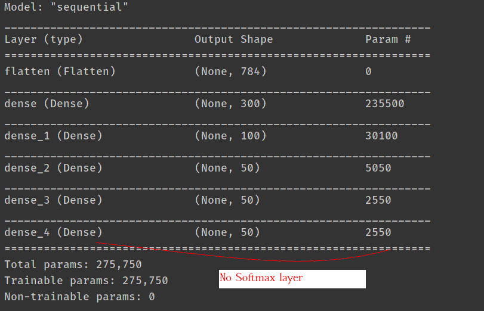

# Notes Training Deep Neural Networks
Batch Normalization
-------------------
Batch Normalization consists of adding an operation in the model function for each hidden layer. This operation simply zero-centers and normalizes each input, then scales 
and shifts the result using two new parameter vectors per layer: one for scaling, the other for shifting. 
In other words, **the operation lets the model learn the optimal scale and mean of each of the layer’s inputs**

### <ins> Batch Norm before activation or after the activation: </ins>

While the original paper talks about applying batch norm just before the activation function, it has 
been found in practice that applying *batch norm after the activation yields better results*. This 
seems to make sense, as if we were to put a activation after batch norm, then the batch norm layer 
cannot fully control the statistics of the input going into the next layer since the output of the 
batch norm layer has to go through an activation. This is not the case with scenario where 
batch norm is applied after an activation.


Let us analyse the each equation
1. **Line1:** Vector of input means, evaluated over the whole mini-batch B (it contains one mean per input).
2. **Line2:** Vector of input standard deviations, also evaluated over the whole mini-batch (it contains one standard 
deviation per input). **m<sub>B</sub>** is the size of the mini-batch.
3. **Line3:** x<sup>^(i)</sup>) Vector of zero-centered and normalized inputs for instance i.
4. Gamma (scale parameter) anb Beta is (shift paramter) with size equal to x<sup>(i)</sup>). Which network will learn.
5. Z<sup>(i)</sup> is the **element wise product** of *gamma*, x<sup>i</sup>, and add *beta*.   

We store moving average of the layer’s input means and standard deviations to perform Batch Normalization at test time.

```python
def get_model():
    model = keras.models.Sequential([
        keras.layers.Flatten(input_shape=[28, 28]),
        keras.layers.BatchNormalization(),
        keras.layers.Dense(300, activation='relu'),
        keras.layers.BatchNormalization(),
        keras.layers.Dense(100, activation='relu'),
        keras.layers.BatchNormalization(),
        keras.layers.Dense(10, activation='relu')
    ])
    return model

def analyse_model():
    model = get_model()
    model.summary()
    layer1 = model.layers[1].variables
    print([(var.name, var.trainable) for var in model.layers[1].variables])
```



As you can see, each BN layer adds four parameters per input: γ, β, μ, and σ (for example, the first BN layer adds 3,136 parameters, which is 4 × 784). The last two
parameters, μ and σ, are the moving averages; they are not affected by backpropagation, so Keras calls them 
“non-trainable” 9 (if you count the total number of BN parameters, 3,136 + 1,200 + 400, and divide by 2, you get 
2,368, which is the total number of non-trainable parameters in this model).

Tansfer Learning(Reusing Pretrained Layers)
-------------------------------------------
Lets understand it by an example:
We will train a model on set A (classification task with 8 classes), and try to reuse it to tackle set B 
(binary classification). We hope to transfer a little bit of knowledge from task A to task B, since classes in 
set A (sneakers, ankle boots, coats, t-shirts, etc.) are somewhat similar to classes in set B (sandals and shirts).

```python
import tensorflow as tf
from tensorflow import keras
import numpy as np

def get_model():
    model_A = keras.models.Sequential() ##init model
    model_A.add(keras.layers.Flatten(input_shape=[28, 28])) ##input
    for n_hidden in (300, 100, 50, 50, 50):
        model_A.add(keras.layers.Dense(n_hidden, activation="relu")) ##adding layers
    model_A.add(keras.layers.Dense(8, activation="softmax")) ##final softmax
    return model_A

def get_dataset(flag):
    fashion_mnist = keras.datasets.fashion_mnist
    (X, y), (X_test, y_test) = fashion_mnist.load_data()
    X = X / 255.

    y_5_or_6 = (y == 5) | (y == 6)  # sandals or shirts
    y_A = y[~y_5_or_6]
    y_A[y_A > 6] -= 2  # class indices 7, 8, 9 should be moved to 5, 6, 7
    y_B = (y[y_5_or_6] == 6).astype(np.float32)  # binary classification task: is it a shirt (class 6)?
    X_A = X[~y_5_or_6]
    X_B = X[y_5_or_6]

    if flag == 'A':
        return X_A, y_A
    else:
        return X_B, y_B

def train_model_A():
    X_train_A, y_train_A = get_dataset('A')
    model_A = get_model()

    model_A.compile(loss="sparse_categorical_crossentropy",
                    optimizer=keras.optimizers.SGD(lr=1e-3),
                    metrics=["accuracy"])

    history = model_A.fit(X_train_A, y_train_A, epochs=20,
                          validation_split=0.2)

    model_A.save("my_model_A.h5")

```
Till now we have perform below task:
1. function *get_model* init a model.
2. function get_dataset split fashion mnsit model in tow parts. Dataset_A 8 class dataset, Dataset_B 2 class dataset.
3. We train model_A ad save as  "my_model_A.h5"

```python
##1 
model_A = keras.models.load_model("my_model_A.h5") ##load model
##2
model_B_on_A = keras.models.Sequential(model_A.layers[:-1]) ##remove softmax layer
model_B_on_A.summary()
```

First 2 lines load the model and remove the last layer i.e softmax layer from pre-trained model_A.



```python
##1
model_B_on_A = keras.models.Sequential(model_A.layers[:-1])
##2
model_B_on_A.add(keras.layers.Dense(1, activation="sigmoid"))
##clone to avoid change while in model_A training 
model_A_clone = keras.models.clone_model(model_A)
model_A_clone.set_weights(model_A.get_weights())

##5
for layer in model_B_on_A.layers[:-1]:
    layer.trainable = False

model_B_on_A.compile(loss="binary_crossentropy",
                     optimizer=keras.optimizers.SGD(lr=1e-3),
                     metrics=["accuracy"]
history = model_B_on_A.fit(X_train_B, y_train_B, epochs=16,
                           validation_split=0.2)
```
Let understand above code snippet:
1. Take pre-trained model_A till and remove last layer and add it to new mode model_B_on_A.
2. Add last layer can be sigmoid layer also depending on the class number. in Dataset_B we have only two classes 
hence sigmoid can do the job.
3. clone the model_A while training model_B it affect model_A weights
4. \##5 line set layers trainable to False and compile and fit the model.

### <ins> Todo <ins> :
1. Write a module for plotting **history** (returned from fit function).   
2. Train CIFAR 10 dataset with pre-trained mobilenetv2, Resnet18.
3. Use ADAM and RADAM and tune learning rate using paper [Cyclical Learning Rates for Training Neural 
Networks](https://arxiv.org/pdf/1506.01186.pdf) .
4. Explore once cycle policy learning rate mechanism.
5. Read paper the [A disciplined approach to neural network hyper-parameters: Part 1 -- learning rate, batch size, momentum, and 
weight decay](https://arxiv.org/pdf/1803.09820.pdf)