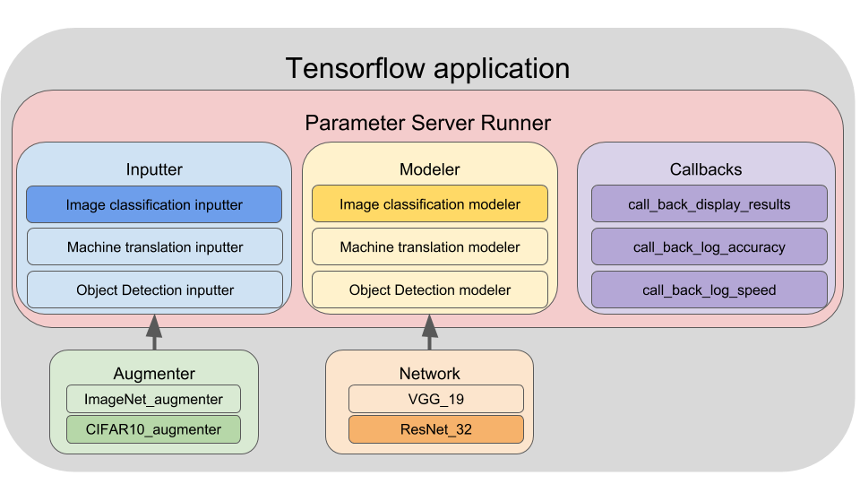

# Application overview

Our TensorFlow demo is comprised of three main components:

## Inputter:

The data pipeline. It reads data from the disk, shuffles and preprocesses the data, creates batches, and does prefetching. An inputter is applicable to a specific problem. For example, we have ***image_classification_inputter, machine_translation_inputter, object_detection_inputter .. etc***. An inputter can optionally own an ***augmenter*** for data augmentation.

## Modeler: 

The model pipeline. The Modeler encapsulates the forward pass and the computation of loss, gradient, and accuracy. Like the inputter, a modeler is applicable to a specific problem such as image classification, object detection ... etc. A modeler must own a network member that implements the network architecture, for example, ResNet32, VGG19 or InceptionV4.

## Runner: 
The executor. It owns an Inputter, a Modeler and a number of callbacks. A runner orchestrates the execution of an Inputter and a Modeler and distributes the workload across multiple hardware devices. It also uses callbacks to perform auxiliary tasks such as logging the statistics of the job and saving the trained model.

Please refer the below figure for the Architecture stack.

### Reference:
1. [How To Classify Images with TensorFlow - a Step-By-Step Tutorial](https://lambdalabs.com/blog/how-to-classify-images-with-tensorflow-a-step-by-step-tutorial/#augmenter)

2. [Lambda Deep Learning Demos](https://github.com/lambdal/lambda-deep-learning-demo)

