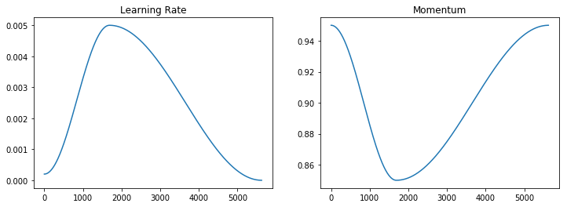
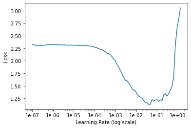

# Super-Convergence: Very Fast Training of Neural Networks Using Large Learning Rates

The basic idea of super-convergence is to make use of a much higher learning rate while still ensuring the network weights converge. This is achieved by through use of the 1Cycle learning rate policy.

## 1 Cycle Policy:

1. Choose a high maximum learning rate and a maximum and minimum momentum.

2. In phase 1, starting from a much lower learning rate (lr_max / div_factor, where div_factor is e.g. 25.) gradually increase the learning rate to the maximum while gradually decreasing the momentum to the minimum.

3. In phase2, reverse the process: decrease learning rate back to the learning rate minimum while increasing the momentum to the maximum momentum.

4. In the final phase, decrease the learning rate further (e.g. lr_max / (div_factor *100), while keeping momentum at the maximum.

`Work from the FastAI team has shown that the policy can be improved by using just two phases`. Below are the phases involve.

1. The same phase 1, however cosine annealing is used to increase the learning rate and decrease the momentum. Span of the phase is usually 30% of the total. Momentum boundaries are (0.85, 0.95).

2. Similarly, the learning rate is decreased again using *cosine annealing*, to a value of approx ~0 `final_lr = lr_max / (div_factor * 1e4)` while momentum increasing to the maximum momentum.



## Choosing Max, Min and Final Learnig Rate:

**max lr:** Please follow the below steps-

1. Start with a very low learning rate e.g. 1-e6.

2. After each batch, increase the learning rate and record the loss and learning rate

3. Stop when a very high learning rate (10+) is reached, or the loss value explodes

4. Plot the recorded losses and learning rates against each other and choose a learning rate where the loss is strictly decreasing at a rapid rate. 



The results of the LRFinder. The losses are plotted against the log scaled learning rates. A good learning rate would be in the range where the loss is strictly decreasing at a rapid rate: [1e-3, 1e-2]. Usually its good idea to start with mean value i.e (1e-3 + 1e-2) /2 . 

**min lr:**
```
    min_lr = max_lr / div_factor
```

**final lr:**
```
    final_lr = lr_max / (div_factor * 1e4)
```

default value of `div_factor = 25` in Fast-Ai API. Please refer [Finding a Learning Rate with TF2](https://www.avanwyk.com/finding-a-learning-rate-in-tensorflow-2/).

`References:`

1. [Super-Convergence: Very Fast Training of Neural Networks Using Large Learning Rates](https://arxiv.org/abs/1708.07120)

2. [Super-convergence in Tensorflow 2 with the 1Cycle Policy](https://www.avanwyk.com/tensorflow-2-super-convergence-with-the-1cycle-policy/)

3. [The 1 Cycle Policy](https://sgugger.github.io/the-1cycle-policy.html)

4. [TF2 super-convergence with the 1Cycle Policy](https://www.kaggle.com/avanwyk/tf2-super-convergence-with-the-1cycle-policy)