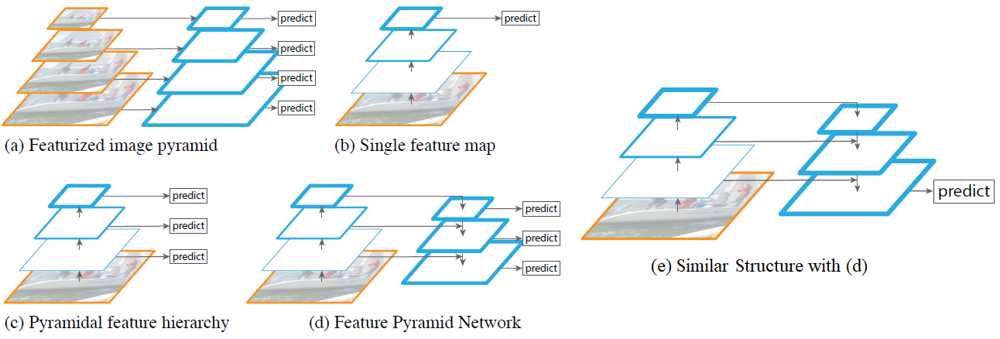
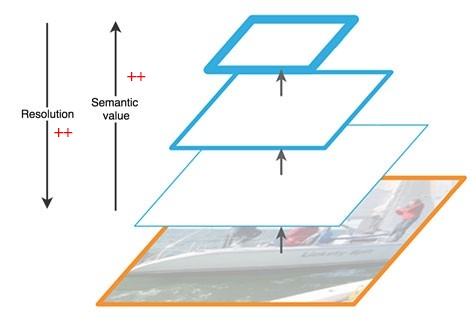
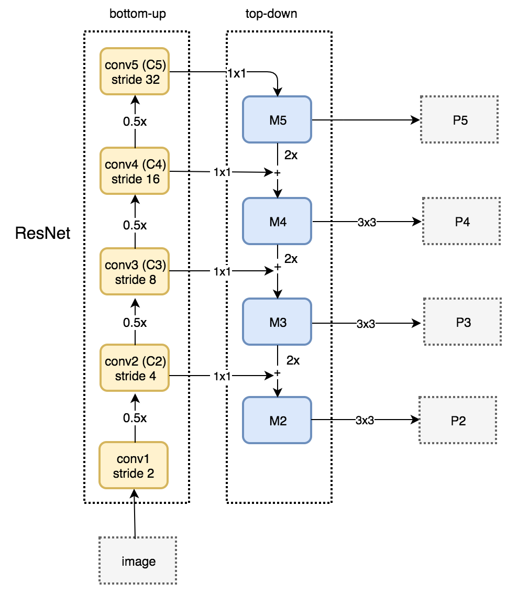
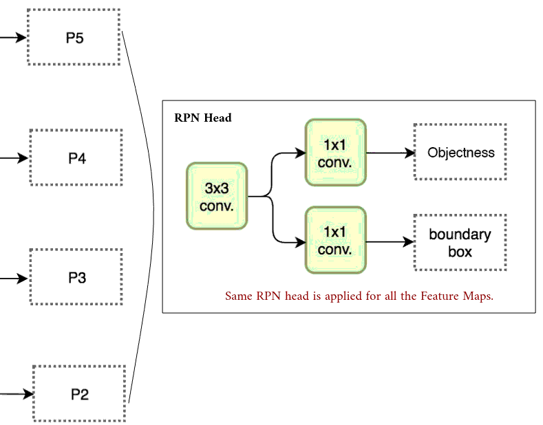

# Feature Pyramid Networks for Object Detection

## Different Architectures for Detection

1. <ins> Featurized image pyramid: </ins> It is heavily used in the era of hand-engineered features.

2. <ins> It is a standard ConvNet solution on a single input image which has the prediction at the end of network.

3. <ins> Pyramidal Feature Hierarchy: </ins> At each layer, prediction is made just like SSD. It reuses the multi-scale feature maps from different layers computed in the forward pass and thus come free of cost. **However, it misses the opportunity to reuse the higher-resolution maps of the feature hierarchy, consequently misses the detection for small objects**.

4. <ins> <mark> Feature Pyramid Network:</mark> </ins> It combines low-resolution, semantically strong features with high-resolution, semantically weak features via a top-down pathway and lateral connections. **This feature pyramid that has rich semantics at all levels** and is built quickly from a single input image scale, thereby without sacrificing representational power, speed, or memory.

5. <ins> Similar Architecture: </ins> Some recent research adopted the similar top-down and skip connections such as TDM, SharpMask, RED-Net, U-Net, which were quite popular at that moment, but only predict at the last stage.

## Data Flow:

FPN composes of a **bottom-up** and a **top-down** pathway. The bottom-up pathway is the usual convolutional network for feature extraction. As we go up, the spatial resolution decreases. With more high-level structures detected, the semantic value for each layer increases.Refer image below.

#### <ins> **Bottom-up and Top-down Pathway** </ins>

The bottom-up pathway uses ResNet to construct the bottom-up pathway. As we move up, the spatial dimension is reduced by 1/2 (i.e. double the stride). The output of each convolution module is labeled as Ci and later used in the top-down pathway.

**We apply a 1 × 1 convolution filter to reduce C5 channel depth to 256-d to create M5.** This becomes the first feature map layer used for object prediction.

As we go down the top-down path, we upsample the previous layer by 2 using nearest neighbors upsampling. We again apply a 1 × 1 convolution to the corresponding feature maps in the bottom-up pathway. Then we add them element-wise. **We apply a 3 × 3 convolution to all merged layers. This filter reduces the aliasing effect when merged with the upsampled layer.**

We repeat the same process for P3 and P2. However, we stop at P2 because the spatial dimension of C1 is too large. Otherwise, it will slow down the process too much. Because we share the same classifier and box regressor of every output feature maps, **all pyramid feature maps (P5, P4, P3 and P2) have 256-d output channels.**

#### <ins> **FPN with Region Proposal Network:** </ins> 

In the FPN framework, for each scale level (say P4), <ins> a 3 × 3 convolution filter is applied over the feature maps followed by separate 1 × 1 convolution for objectness predictions and boundary box regression. **These 3 × 3 and 1 × 1 convolutional layers are called the RPN head. The same head is applied to all different scale levels of feature maps.** </ins>

#### <ins> **FPN with Fast R-CNN or Faster R-CNN:** </ins>

In FPN, we generate a pyramid of feature maps. We apply the RPN (described in the previous section) to generate ROIs. **Based on the size of the ROI, we select the feature map layer in the most proper scale to extract the feature patches.**

The formula to pick the feature maps scale is based on the width w and height h of the ROI.

|  |
|  |
|:--:|
| Formula to calculate feature scale. |

So if k = 3, we select P3 as our feature maps. We apply the ROI pooling and feed the result to the Fast R-CNN head (Fast R-CNN and Faster R-CNN have the same head) to finish the prediction.
